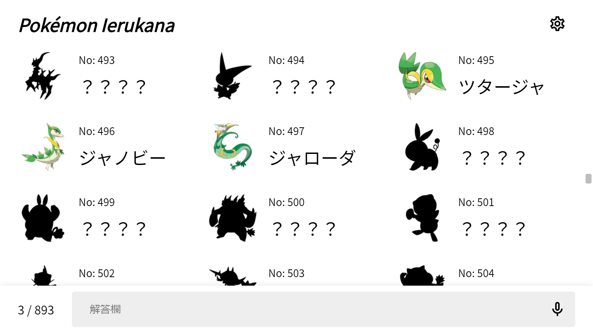

# [_Pokémon Ierukana_](https://canoypa.github.io/pokemon-ierukana/)

これまでの全 893 匹のポケモンをどこまで言えるかチャレンジするゲームです。

## ゲーム内容

  

これまでの全ポケモンをただただ答えていくだけです。

フォルムチェンジ, メガシンカ, キョダイマックス などを除いた、映画 ココ までの 893 匹が含まれています。

### _Dareda Mode_

「図鑑 No しか情報がない！無理！！」 ということで、_Dareda Mode_ が実装されています。

- 名前の通りシルエットが表示されるモードです
- デフォルトでは無効になっています
- 設定 -> ゲームモード から変更可能です

### 音声入力

「入力が辛い！「不思議だね」 になる！！」 ということで、音声入力を利用することが出来ます。

WebkitSpeechRecognition を使用しているため、Chrome, Edge (Chromium) などの一部のブラウザでのみ利用可能です。

- 音声データが Google に送信されるみたいです
- 一部のポケモン (ピィ, ウッウ など) が正しく認識されません
